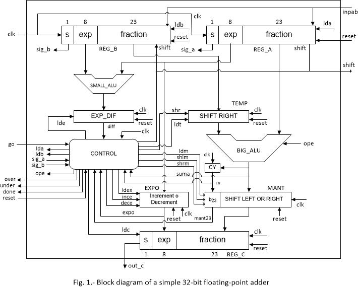
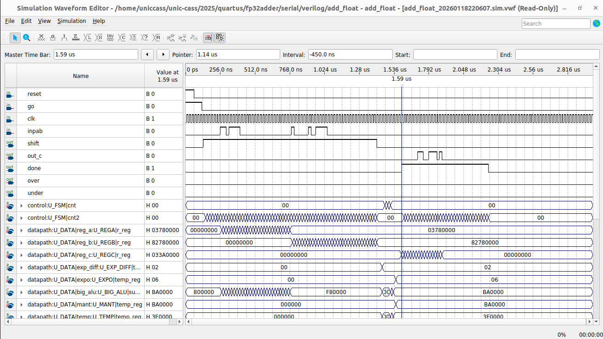
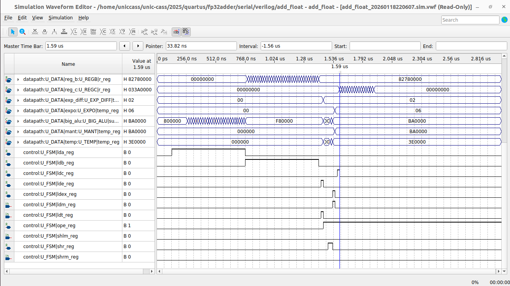
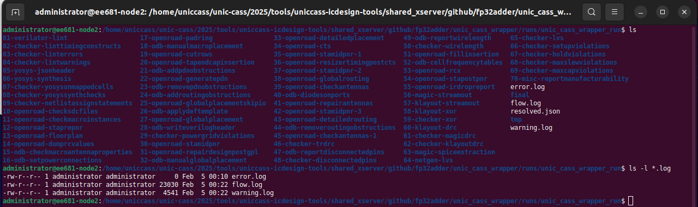
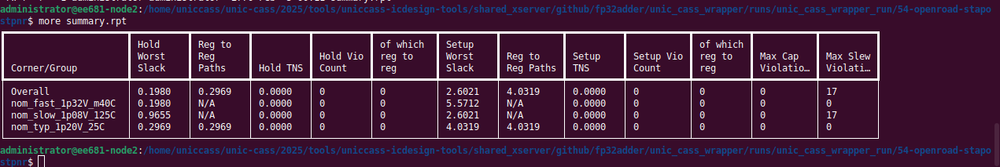
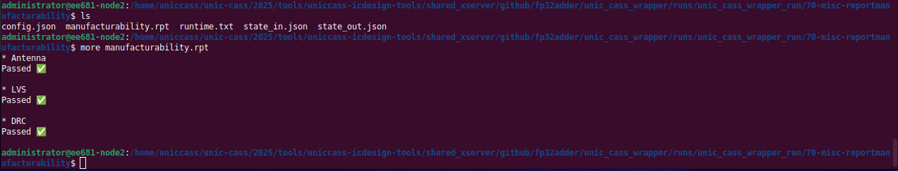
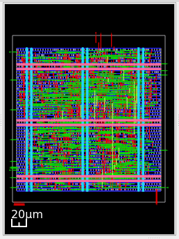
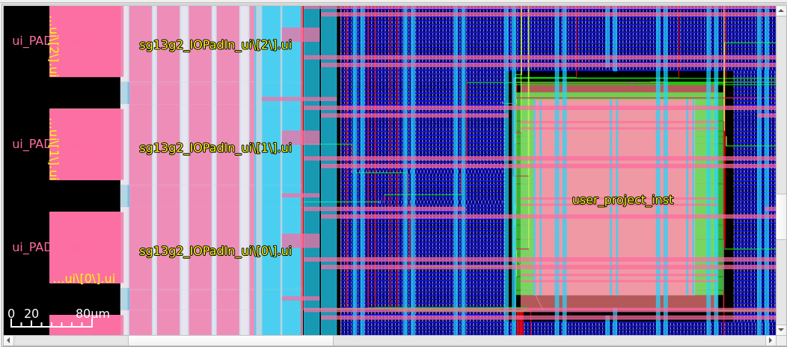

[](https://github.com/unic-cass/unic-cass-wrapper/actions/workflows/digital-flow.yaml)

# VLSI implementation of a simple 32-bit floating-point adder based on IEEE 754 using open-source software tools 

> **Project Status:**
>This repository represents an initial report for the project using the UNIC-CASS open-source software tools and the steps performed to the integration of the design to the pad ring for the mock tapeout. The contents of this report will evolve as we go further in the final integration of the design to the final pad ring for the final tape out.

## Team members - Universidad Nacional de Ingeniería, Perú
 - Ariel Amado Frias (student)
 - Alejandro Estefano Zavaleta (student)
 - Manuel Julián Pasión (student)
 - Angel Edmanuel Aguado (student)
 - Aurelio Morales-Villanueva, PhD (mentor)

Table of contents
=================

1. [Description of the project](#description-of-the-project)
2. [Block diagram of the 32-bit floating point adder](#block-diagram-of-the-32-bit-floating-point-adder)
3. [Simulations with Quartus Prime Lite Edition](#simulations-with-quartus-prime-lite-edition)
4. [Integration for mock tapeout](#integration-for-mock-tapeout)
5. [Report of the entire chip flow performed with Librelane](#report-of-the-entire-chip-flow-performed-with-librelane)
6. [Static Timing Analysis after Place and Route](#static-timing-analysis-after-place-and-route)
7. [Report for Manufacturability](#report-for-manufacturability)
8. [View of the design with Openroad before pad ring integration](#view-of-the-design-with-openroad-before-pad-ring-integration)
9. [View of the design with Openroad after pad ring integration](#view-of-the-design-with-openroad-after-pad-ring-integration)


Description of the project 
==========================

The intended design to be integrated on a VLSI chip using IHP SG13G2 PDK is a basic 32-bit floating point adder 
based on IEEE 754. All the modules will be purely digital. According to the block diagram provided, the "reset" 
input asynchronously resets the entire design, then after signal "go" is active (from high to low), two 32-bit 
floating-point numbers are loaded into registers REG_A and REG_B in a serial fashion using one single input "inpab" 
(first REG_A, then REG_B, both from LSB to MSB), using output "shift" for 64 clock pulses, assuming that REG_A is 
greater than REG_B, and the CONTROL block, based on a Finite State Machine (FSM) Moore machine, sends an receives 
several signals to/from others block, and finally the result is generated on REG_C. REG_C is shifted out to the 
left via the output "reg_c" while "done" signal is high for 32 clock pulses.

The design is specified using a behavioral and structural level description of a controller and datapath based 
on the FSM+D model (Finite State Machine + Datapath), and using the Verilog hardware description language. 
The 32-bit floating point adder circuit will not perform rounding or truncation of the result. It will always be 
assumed that the exponent of the REG_A register will be greater than or equal to the exponent of the REG_B register. 

The circuit design will be implemented hierarchically, using the Verilog hardware description language, with 
a top-level file (add_float), and 10 modules (BIG_ALU, CONTROL, EXP_DIF, EXPO, MANT, REG_A, REG_B, REG_C, SMALL_ALU, 
and TEMP). The BIG_ALU block takes care of the addition of the fraction part of each input register REG_A and REG_B. 

The CONTROL block implements a Moore state machine that takes care of the sequencing of control signals to make sure the 
floating-point addition result is consistent. EXP_DIF, is a register that loads the difference of REG_A and REG_B's exponents. 
EXPO is a register that is incremented or decremented if the preliminary result of the floating addition ins not normalized. 
MANT is a register that holds the preliminary result of the fraction part of the floating addition. SMALL_ALU, is an ALU 
that obtains the difference of REG_A and REG_B's exponents. 

TEMP is a register that holds the REG_B's fraction that is shifted to align REG_B's exponent with the REG_A's exponent. 
The digital circuit has an external signal "go" such that, after the CONTROL module leaves the reset state, 
the value of the "go" signal is verified. While go = "1", the CONTROL module remains in a state" waiting for go = "0". 

When "go" goes to "0", the values in the REG_A and REG_B registers will be loaded in a serial fashion by 64 clock pulses,
and then the floating-point addition opertation starts. At the end of the floating-point addition operation, 
the circuit must produce the signal done = "1". If the result of the addition generates an overflow or underflow, over = "1" 
or under = "1" must be generated, respectively, and "0" for these signals in case of a normal result. On the other 
hand, there will be an external "reset" signal, such that when applied (value "1"), the entire circuit resets asynchronously.

Initially, the design was implemented and tested on a Cyclone V SoC FPGA from Altera (now Intel), using Electronic Design 
Automation (EDA) Quartus Prime Lite Edition 25.1, first for VHDL hardware description language, and later converted to 
Verilog hardware description language. The initial version of Verilog hardware description for Quartus was adapted to work 
with Librelane. Initial simulations were performed with Vector Waveform File (VWF) from Quartus, and some testbenches were 
also performed using EDA Playground (https://www.edaplayground.com)

Block diagram of the 32-bit floating point adder
================================================


Simulations with Quartus Prime Lite Edition
===========================================

Behavioral simulation on Cyclone V SoC FPGA of 32-bit floating point adder using Quartus Prime Lite Edition 25.1 (1 of 2)


Behavioral simulation on Cyclone V SoC FPGA of 32-bit floating point adder using Quartus Prime Lite Edition 25.1 (2 of 2)

Integration for mock tapeout
============================

This part of the report was already included as part of the first milestone on 27/01/2026 in the README located at [docs](https://github.com/aureliomoralesv/fp32adder/tree/b76bced529d6ac0d960cf93f927288e4b94851ef/docs) folder. The initial steps for the integration of the digital design project to the pad ring is based on the UNIC-CASS Wrapper as an open-source chip integration template designed to standardize and simplify the integration of UNIC-CASS circuit designs for fabrication using the IHP open-source PDK. Please, read that report, which include all the steps and customization performed for the integration of the design to the initial pad ring for the mock tapeout.

The source Verilog design files for the "Classic Flow" using Librelane (without the pad ring integration) are located at [src](https://github.com/aureliomoralesv/fp32adder/tree/b8571a2f5f8cd6c161ebd30f408a68f6af07dec4/unic_cass_wrapper_user_project/fp32adder/src) folder, and, the source SystemVerilog file for the integration of the entire design with the pad ring, i.e. the "Chip Flow" using Librelane is located at [src](https://github.com/aureliomoralesv/fp32adder/tree/b8571a2f5f8cd6c161ebd30f408a68f6af07dec4/unic_cass_wrapper/src) folder. The SystemVerilog file may be viewed [here](https://github.com/aureliomoralesv/fp32adder/blob/b8571a2f5f8cd6c161ebd30f408a68f6af07dec4/unic_cass_wrapper/src/user_project_wrapper.sv)

Also, inside the [docs](https://github.com/aureliomoralesv/fp32adder/tree/b76bced529d6ac0d960cf93f927288e4b94851ef/docs) folder, there is the [testbenches](https://github.com/aureliomoralesv/fp32adder/tree/b76bced529d6ac0d960cf93f927288e4b94851ef/docs/testbenches) folder, which includes several testbenches for the design in order to verify the behavioral results using different operands and using the Questa simulation tool included as part of the Quartus Prime Lite Edition 25.1. Also, in the testbenches folder, the Questa-step-by-step.pdf shows the steps to be performed for the functional simulation of the original design which was useful to detect possible bugs in the design.

Report of the entire chip flow performed with Librelane
=======================================================

The following image shows all the folders generated when the "chip flow" was performed using Librelane. The entire flow performs the logic synthesis and optimizations, mapping, place and route, timing constraints analysis using the Synopsys Design Constraint (*sdc) file, static timing analysis after place and route, design rule checking (DRC), and layout versus schematic (LVS) check for manufacturing and pad ring integration, where the error.log file shows no errors, while the warnings in the warning.log are related with no parasitics extraction found at corners of nom_fast_1p32V_m40C and nom_slow_1p08V_125C models and a warning related to 'VSRC_LOC_FILES' that was not given a value, which may make the results of IR drop analysis inaccurate. But, since at this stage we are not integrating a top-level chip for manufacture, we may ignore the last warning.


Image that captures the entire chip flow performed with Librelane 

Static Timing Analysis after Place and Route
============================================

Static timing analysis with Openroad after Place & Route of the design

Report for Manufacturability
============================

Report for manufacturability (Antenna, DRC and LVS) of the design

View of the design with Openroad before pad ring integration
============================================================
You may check the README located at [docs](https://github.com/aureliomoralesv/fp32adder/tree/b76bced529d6ac0d960cf93f927288e4b94851ef/docs) folder for specific details. The following steps show the "Classic" flow of the design using Librelane before the pad ring integration:
1. Start hardening the design:
    - Create the subdirectory "fp32adder" for the design project under the unic_cass_wrapper_user_project/ directory with Librelane configuration file (config.json). You can use the [user_project_example](https://github.com/aureliomoralesv/fp32adder/tree/3a5ff03c90c2172e87b65fef938de0074d8e93b0/unic_cass_wrapper_user_project/user_project_example) as a template.
    - Provide the RTL Verilog files of the design for Librelane inside the unic_cass_wrapper_user_project/fp32adder/src/ and modify them accordingly using the initial lines of user_project_example.v in unic_cass_wrapper_user_project/user_project_example/src/ and related to power and ground, and for all instantiations of your modules.
    - In order to avoid problems of integrating the design into the UNIC-CASS wrapper, specially if the design uses less inputs than 17 (wires ui_PAD2CORE) and less outputs than 17 (wires uo_CORE2PAD), and the use of wires clk_i (for the clock) and rst_ni (for the reset), use the user_project_example.v as a template to be your new and fake "top level" design file for the project, and just modify the instantiation of the real "top level" of the design. In our case the fake "top level" is user_project.v that wraps the real "top level" design, which is add_float.v
    - Extra outputs are tied to "1", and extra inputs are tied to dummy signal, in order to avoid problems. The following lines shows the contents of user_project.v as a fake "top level" design that instantiate add_float.v

        ``` verilog
        module user_project(
            `ifdef USE_POWER_PINS
            inout VPWR,    // Common digital supply
            inout VGND,    // Common digital ground
            `endif
            input  wire clk_i,
            input  wire rst_ni,
            input  wire [16:0] ui_PAD2CORE,
            output  wire [16:0] uo_CORE2PAD
        );
            assign uo_CORE2PAD[16:5] = 12'hFFF; // Tie off unused outputs
            wire [16:2] dummy_read = ui_PAD2CORE[16:2];

        add_float add_float_inst(
            `ifdef USE_POWER_PINS
            .VPWR   (VPWR),
            .VGND   (VGND),
            `endif
            .clk   (clk_i),
            .reset (rst_ni),
            .go    (ui_PAD2CORE[0]),
            .inpab (ui_PAD2CORE[1]),
            .shift (uo_CORE2PAD[0]),
            .out_c (uo_CORE2PAD[1]),
            .over  (uo_CORE2PAD[2]),
            .under (uo_CORE2PAD[3]),
            .done  (uo_CORE2PAD[4])
        );
        endmodule
        ```
    - Build your design GDSII.
        ```
        cd unic_cass_wrapper_user_project/
        make fp32adder
        ```
    - Finally, you can explore the results:
        ```
        make fp32adder VIEW_RESULTS=1
        ```
The following image depicts the result of this last command showing the implemented design without the pad ring integration.



View of the design without pad ring integration using OpenRoad

View of the design with Openroad after pad ring integration
===========================================================
You may check the README located at [docs](https://github.com/aureliomoralesv/fp32adder/tree/b76bced529d6ac0d960cf93f927288e4b94851ef/docs) folder for specific details. The following steps show the "Chip" flow of the design using Librelane for the pad ring integration:
1. Integrate modules into the user_project_wrapper:
    - Instantiate the design in [user_project_wrapper.v](https://github.com/aureliomoralesv/fp32adder/blob/ee3240588e51683d62ce7d9f8f045b8e87ded665/unic_cass_wrapper/src/user_project_wrapper.sv). You must **only modify the module name and the instance name**. **Do not change the instance pin connections**, as they are required for correct integration with the unic_cass_wrapper.
    - Update the macros in the [config.json](https://github.com/aureliomoralesv/fp32adder/blob/ee3240588e51683d62ce7d9f8f045b8e87ded665/unic_cass_wrapper/config.json) file. Make sure to provide:
        - your design name (in this case, user_project_wrapper)
        - GDS path
        - LEF path
        - NL (netlist) path
        - LIB path
        - SPEF path
        - Module instance with the desired position (the position is up to you) 
    - According to the instantiation of add_float.v (real top of hierarchy of the entire design), the following signals are connected to the following inputs or outputs:
       ```
        - clk   (input)  goes to clk_i          (WEST side of pad ring)
        - reset (input)  goes to rst_ni         (WEST side of pad ring)
        - go    (input)  goes to ui_PAD2CORE[0] (WEST side of pad ring)
        - inpab (input)  goes to ui_PAD2CORE[1] (WEST side of pad ring)
        - shift (output) goes to uo_CORE2PAD[0] (EAST side of pad ring)
        - out_c (output) goes to uo_CORE2PAD[1] (EAST side of pad ring)
        - over  (output) goes to uo_CORE2PAD[2] (EAST side of pad ring)
        - under (output) goes to uo_CORE2PAD[3] (EAST side of pad ring)
        - done  (output) goes to uo_CORE2PAD[4] (EAST side of pad ring)
       ```
    - Harden the user_project_wrapper with the modules:
        ```
        cd unic_cass_wrapper
        make
        ```
    - Finally, you can explore the results.
        ```
        make view_results
        ```
The following image depicts the result of this last command showing the implemented design with the pad ring integration.

Zoom view of the placed design and integrated with the pad ring using OpenRoad
