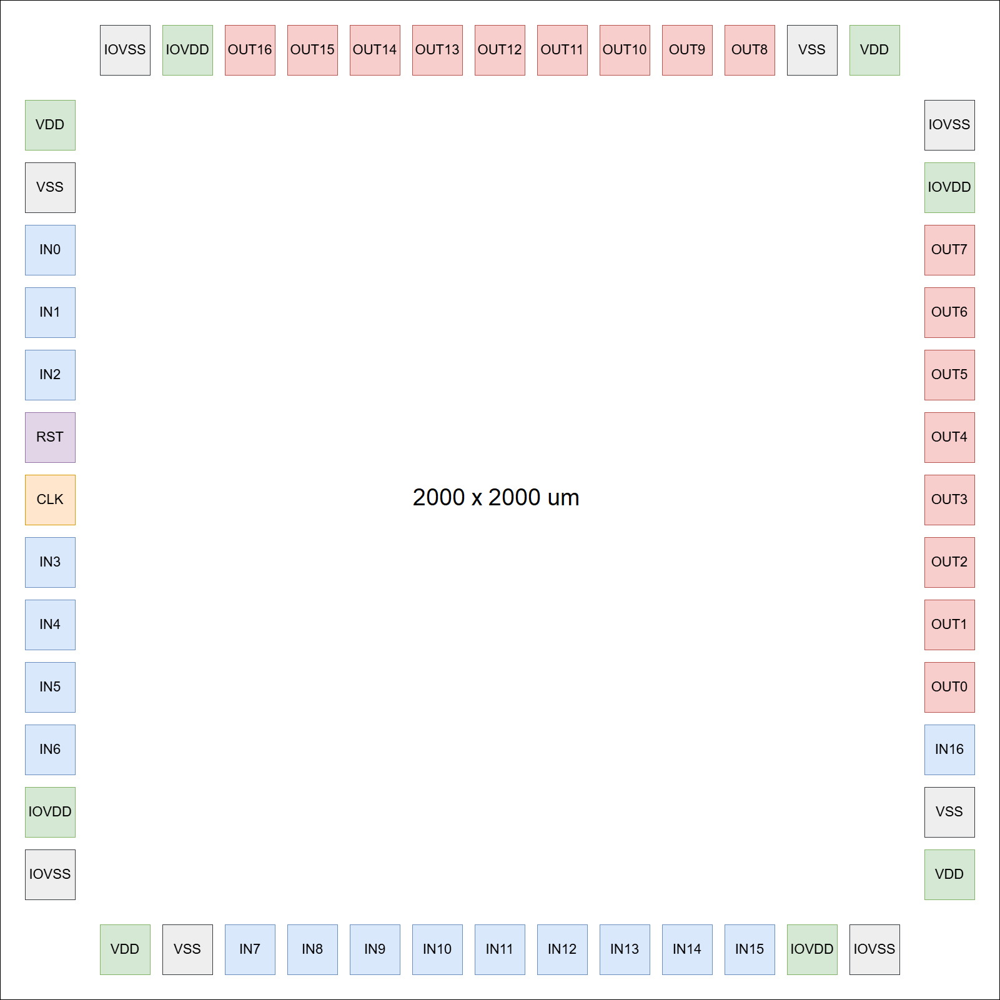
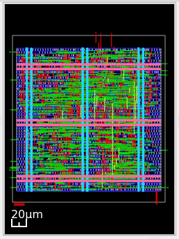
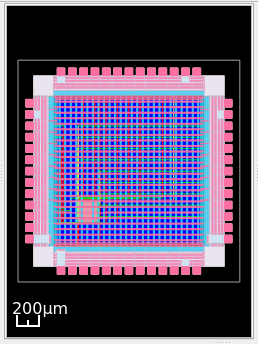

[](https://github.com/unic-cass/unic-cass-wrapper/actions/workflows/digital-flow.yaml)

# Steps to the integration of the design to a pad ring 

> **Project Status:**
>This repository represents an initial version of the steps performed to the integration of the design to the pad ring for the mock tapeout. The contents of this report will evolve as we go further in the final integration of the design to the pad ring for the final tape out.

Table of contents
=================

1. [Overview](#overview)
2. [Prerequisites](#prerequisites)
2. [Integration for mock tapeout](#integration-for-mock-tapeout)
3. [GPIO Configuration](#gpio-configuration)
4. [Layout of the design without pad ring](#layout-of-the-design-without-pad-ring)
5. [Layout of the design with pad ring](#layout-of-the-design-with-pad-ring)

Overview
========

This report includes the initial steps of the integration of the digital design project to the pad ring based on the UNIC-CASS Wrapper 
as an open-source chip integration template designed to standardize and simplify the integration of UNIC-CASS circuit designs for 
fabrication using the IHP open-source PDK.

The UNIC-CASS wrapper was inspired by the Caravel integration concept, which provides a lightweight wrapper architecture that enables 
designers to focus on their core circuit designs while relying on a predefined, reusable top-level structure for chip-level integration. 
Unlike Caravel, the UNIC-CASS Wrapper does not implement a System-on-Chip (SoC); instead, it serves purely as a generic template for 
integrating one or more user designs into a manufacturable chip.

Prerequisites
=============

The unic-cass-wrapper is designed to work inside the [uniccass-icdesign-tools](https://github.com/unic-cass/uniccass-icdesign-tools) Docker container.
Make sure the container is properly installed and running before continuing with the initial integration of the design for the mock tapeout.

Integration for mock tapeout
============================

### Starting Your Project

1. Create a new repository based on the unic-cass-wrapper template. Ensure that your repository is public and includes a README.
    - Follow [this link](https://github.com/unic-cass/unic-cass-wrapper/fork) to create your repository.
    - Clone the repository using:
        ```
        git clone <your GitHub repository URL>
        ```
    - In this case, our Github repository (forked from UNIC-CASS) is located at https://github.com/aureliomoralesv/fp32adder

2. Set up your local environment:
    ```
    cd fp32adder
    make setup
    ```
    This command installs:
    - Submodules

3. Start hardening the design:
    - Create the subdirectory "fp32adder" for the design project under the unic_cass_wrapper_user_project/ directory with Librelane configuration file (config.json). You can use the [user_project_example](https://github.com/aureliomoralesv/fp32adder/tree/3a5ff03c90c2172e87b65fef938de0074d8e93b0/unic_cass_wrapper_user_project/user_project_example) as a template.
    - Provide the RTL Verilog files of the design for Librelane inside the unic_cass_wrapper_user_project/fp32adder/src/ and modify them accordingly using the initial lines of user_project_example.v in unic_cass_wrapper_user_project/user_project_example/src/ and related to power and ground, and for all instantiations of your modules.
    - In order to avoid problems of integrating the design into the UNIC-CASS wrapper, specially if the design uses less inputs than 17 (wires ui_PAD2CORE) and less outputs than 17 (wires uo_CORE2PAD), and the use of wires clk_i (for the clock) and rst_ni (for the reset), use the user_project_example.v as a template to be your new and fake "top level" design file for the project, and just modify the instantiation of the real "top level" of the design. In our case the fake "top level" is user_project.v that wraps the real "top level" design, which is add_float.v
    - Extra outputs are tied to "1", and extra inputs are tied to dummy signal, in order to avoid problems. The following lines shows the contents of user_project.v as a fake "top level" design that instantiate add_float.v

        ``` verilog
        module user_project(
            `ifdef USE_POWER_PINS
            inout VPWR,    // Common digital supply
            inout VGND,    // Common digital ground
            `endif
            input  wire clk_i,
            input  wire rst_ni,
            input  wire [16:0] ui_PAD2CORE,
            output  wire [16:0] uo_CORE2PAD
        );
            assign uo_CORE2PAD[16:5] = 12'hFFF; // Tie off unused outputs
            wire [16:2] dummy_read = ui_PAD2CORE[16:2];

        add_float add_float_inst(
            `ifdef USE_POWER_PINS
            .VPWR   (VPWR),
            .VGND   (VGND),
            `endif
            .clk   (clk_i),
            .reset (rst_ni),
            .go    (ui_PAD2CORE[0]),
            .inpab (ui_PAD2CORE[1]),
            .shift (uo_CORE2PAD[0]),
            .out_c (uo_CORE2PAD[1]),
            .over  (uo_CORE2PAD[2]),
            .under (uo_CORE2PAD[3]),
            .done  (uo_CORE2PAD[4])
        );
        endmodule
        ```
    - Build your design GDSII.

        ```
        cd unic_cass_wrapper_user_project/
        make fp32adder
        ```
    - Finally, you can explore the results:
        ```
        make fp32adder VIEW_RESULTS=1
        ```
4. Integrate modules into the user_project_wrapper:
    1. Instantiate the design in [user_project_wrapper.v](https://github.com/aureliomoralesv/fp32adder/blob/ee3240588e51683d62ce7d9f8f045b8e87ded665/unic_cass_wrapper/src/user_project_wrapper.sv). You must **only modify the module name and the instance name**. **Do not change the instance pin connections**, as they are required for correct integration with the unic_cass_wrapper.
    2. Update the macros in the [config.json](https://github.com/aureliomoralesv/fp32adder/blob/ee3240588e51683d62ce7d9f8f045b8e87ded665/unic_cass_wrapper/config.json) file. Make sure to provide:
        - your design name (in this case, user_project_wrapper)
        - GDS path
        - LEF path
        - NL (netlist) path
        - LIB path
        - SPEF path
        - Module instance with the desired position (the position is up to you)
    3. According to the instantiation of add_float.v (real top of hierarchy of the entire design), the following signals are connected to the following inputs or outputs:
       ```
        - clk   (input)  goes to clk_i          (WEST side of pad ring)
        - reset (input)  goes to rst_ni         (WEST side of pad ring)
        - go    (input)  goes to ui_PAD2CORE[0] (WEST side of pad ring)
        - inpab (input)  goes to ui_PAD2CORE[0] (WEST side of pad ring)
        - shift (output) goes to uo_CORE2PAD[0] (EAST side of pad ring)
        - out_c (output) goes to uo_CORE2PAD[1] (EAST side of pad ring)
        - over  (output) goes to uo_CORE2PAD[2] (EAST side of pad ring)
        - under (output) goes to uo_CORE2PAD[3] (EAST side of pad ring)
        - done  (output) goes to uo_CORE2PAD[4] (EAST side of pad ring)
       ```
    4. Harden the user_project_wrapper with the modules:
        ```
        cd unic_cass_wrapper
        make
        ```
    4. Finally, you can explore the results.
        ```
        make view_results
        ```
5. After you have gone through the flow successfully, update the [designs](https://github.com/aureliomoralesv/fp32adder/blob/c4ebee0453694aacd2b4314958e86af9f2444644/Makefile) variable in the main Makefile of the main directory and run it as it shows in the next step. 

6. Go to main directory and run the main Makefile:
    ```
    cd ..
    make librelane
    ```

    1. This command runs again the complete flow twice, first the "Classic" flow for the entire design without the pad ring, and then the "Chip" flow of the design and the integration with the pad ring
    2. If it passes DRC and LVS it is ready for the mock tapeout.

7. This main Makefile will be run in github every time you push a change. The action must pass in order to complete the mock tapeout process.

GPIO Configuration
==================



Layout of the design without pad ring
=====================================


Layout of the design with pad ring
==================================



